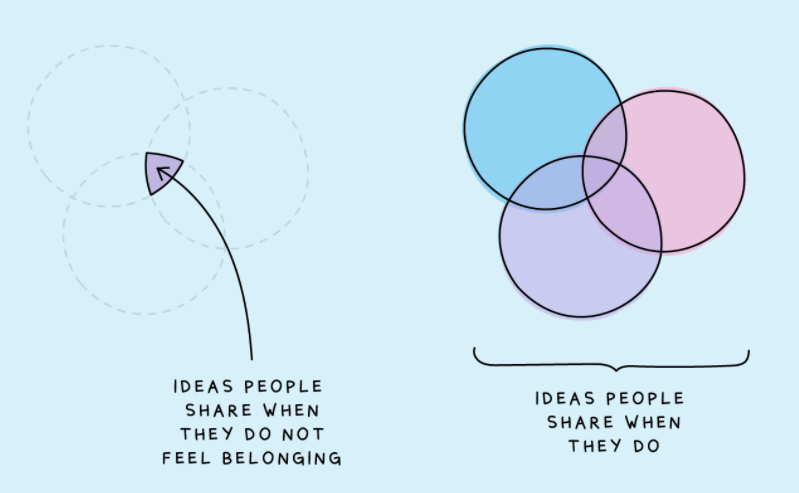

# Qualitative questions

The purpose of this chapter is to get you thinking about how to formulate good questions for different qualitative research methods, and what things to avoid. Do the activities below on your own and then discuss your answers with your group.

## Focus Groups

When you are conducting qualitative research, thinking about the questions you are going to ask your participants is really important to ensure your data will be rich and good quality. You want to write questions that are clear, open-ended and prompt the participants to discuss/share their experiences. Here are ten tips for writing good focus group questions: 

1. Ensure that the questions on your Focus Group Schedule are relevant and allow you to explore and possibly answer your research questions.

2. Remember you are not doing quantitative research! The beauty of qualitative research is that your participants can respond in a variety of ways and tell you all about their experiences. In order to allow them to do this, don’t ask them questions, such as: Do people like A more than B? Does one thing cause another?

3. Make sure that your questions are open-ended, such as: What are your experiences of… , Can you think of a situation when…? This will keep conversation going. Don't ask questions that prompt a simple yes/no answer.

4. Don’t write questions that are leading e.g. Do you agree that.... You are investigating something you don’t know the answer to. Even if you think you might know the answer your questions should not reflect this.

5. Think about ethics!  Are the questions you are asking people ethically problematic?  If they are, it doesn’t always mean you should not ask them, you just have to be more cautious when you do!

6. Think about time.The focus group is normally around 30-40 mins long. It takes quite a bit of time to get through a focus group schedule, especially if you have to ask additional questions. We would recommend you have 5 or maybe 6 questions/discussion points on your schedule.

7. It is useful to put a star next to/highlight the really important questions you want to ask.  This means that if you do start to run out of time then you can miss some of the other questions and go straight to these questions.

8. Think about the order of the questions on the schedule. You want to create a discussion that is as natural as possible, and this means one question should follow from the next. If you structure the questions well at this point you may find that in the focus group you have to say very little in order to cover everything.

9. Have an opening question that makes people feel relaxed and gets them talking.  Something that people can discuss easily and something they don’t need to think about too much. 

10. Additional prompts underneath the questions can be helpful for the person running the focus group, especially when you are new to qualitative research. See below for some examples from a study Ashley was involved with a few years ago. So, think of some probing questions that might allow people to discuss the question/topic in more detail. You might not have to use these, but they are there if you do!

## Interviews

Many of the rules for good focus group questions also apply to interviews (e.g. writing open-ended questions that are not leading, having prompts ready etc.). However, in an interview, the researcher is typically one-on-one with a participant, which means that the discussion may in some cases be a bit less structured than a focus group schedule and may need to include more probes.

This is one section from a semi-structured interview schedule Ashley conducted, and is provided purely to give an example of how you might follow up your questions with prompts or probes. Please note that these were sensitive interviews that required NHS ethical approval, and therefore will likely be very different to any research you will be doing during the ODL course in terms of content/tone.

|Questions about receiving anxiety interventions| PROBES             |
|-----------------------------------------------|--------------------|
| What help have you received for your anxiety? | What help did you receive in the past? Are you currently receiving help? Who helps/helped you?|
|Do you feel as if the help you received (or are receiving) has made any difference to your anxiety? It may have made a positive difference, a negative difference or no difference at all. | Anything else?|
|What was the best thing about the help you received for your anxiety? | How did it help? Anything else? |
|What was the worst thing about the help you received for your anxiety? | Can you expand on this? Anything else? | What, in your opinion, would have helped the most when receiving help for your anxiety? | Why would this have helped? Anything else? |
|Some interventions will be adapted for the specific needs of the client.  Did the help you received seem to be modified in any way?  If so, what changes were made, in your opinion.| If there were changes, were they helpful? What helped the most? If any changes at all could have been made, what would your suggestions be?|
|If someone was to develop an intervention to help adults with ASD with their anxiety, what would help the most, in your opinion? | What would be the best type of intervention? What changes should be made? What information could you give that would help the person giving the intervention? |


## Qualitative surveys

Many of the principles discussed above also apply to qualitative survey questions - you want your questions to be clear, qualitative, and open-ended. However, due to the different response format and the fact that you are not there to clarify or provide prompts, there are some additional things to take into account when designing qualitative surveys. Here are some tips for writing good qualitative survey questions:

1.  You don't get instant feedback from your participants the same way you do in focus groups or interviews - hence, it's really important to ensure your questions are clear before starting data collection. Pre-testing the questions with people who are not involved in the project is a good way to do this.

2. Clarity of the questions is particularly important - make sure there is no ambiguity and keep your questions short.

3. Avoid questions which have multiple parts (as participants may just pick up on one) - if your question has multiple parts, it might be better to split it into two

4. Think of the order of your questions - if you start with a broad, over-arching question, participants might only answer this question and write "see above" in others, which reduced the richness of your data

5. You can provide examples in brackets after the question that work as "prompts" and help the participant answer the question. However, be careful not to steer them too much or assume what their answer will be. In a recent qualitative survey that Wil conducted, this was one of the questions: "What do you think language barriers in teaching are, and what are your experiences (and/or those of your colleagues) of them in teaching international students? (Here you may want to reflect on your experience of teaching, tutoring, supervising and interacting with international students.)" 

6. Include a final open question that allows the participant to share anything they would like to add. For example: "Is there anything else you would like to add about … ?"

7. Don't include too many topic questions - this will reduce the quality of your data as participants will get tired and more likely to drop out (you may have some demographic questions which are shorter and that's fine).

## Activities

### Activity 1: Which of these questions would you change and why?

Have a look at these fictional focus group questions and write down which ones you would change and why.

Research question: How does students' sense of belonging relate to participation in team sports?

1. How many hours of group sport do you participate in each week?
2. What does being a part of a team mean to you?
3. What does belonging mean to you?
4. How has your sense of belonging improved since joining your sports team?
5. I am going to go around the group one-by-one and I want everybody to tell me about a time when they felt that they haven't belonged to a team, and how that impacted them personally?
6. Tell me on a scale from 1-5, how much do you feel like you belong to a sports team
7. Do you like being part of a sports team?

`r hide("Suggested answers")`
  * **Question 1.** This question will result in a numeric answer that does not produce meaningful qualitative data. Be careful not to accidentally ask quantitative questions!
  * **Question 2. and 3.** These two questions are open-ended and qualitative, and will likely provide rich answers. One thing to think about is what question to start with and where to include prompts - number 3 is quite big and vague, and participants may struggle to get started with this, especially if it's early on in the FG.
  * **Question 4.** This is a leading question - it implies that their sense of belonging has indeed *improved* when this may not be the case. A better way to phrase this would be: **"Has your sense of belonging changed since joining a team? If so, how? If not, why not?"**
  * **Question 5.** This question puts participants on the spot, which is something you never want to do, especially with a sensitive question like this. Instead, the question should be given to the group, so participants can answer if they want to, and disclose as much or as little they wish to.
  * **Question 6.** This is a quantitative question and does not provide meaningful qualitative data.
  * **Question 7.** This is a yes/no-question. You should avoid phrasing questions like this, as they don't prompt rich answers. Instead, you may want to ask something like: **"What has been the best part about joining a team and why?** or **What aspects of being part of a team do you like? Why?** If you ask a yes/no-question, make sure to open it with some propmts (see example above for question 4).
`r unhide()`

## Activity 2: Re-wording questions

Have a look at these poorly written fictional focus group questions. Try to re-write them to improve them for clarity and the quality of data they would give you.


Research question: Exploring international students' experiences of their sense of belonging and homesickness

1. Have you ever felt homesick while studying abroad?
2. How has this negatively affected you?
3. How often do you feel like you don't belong?
4. Does homesickness ever make you feel like you don't belong?
5. What do you do to feel better?

When you are happy with your own answers, go through the suggested answers below.

`r hide("Suggested answers")`

  * Question 1: This question prompts a yes/no answer  - a better way to phrase this would be: **"What have your experiences of homesickness been while studying abroad?"**
  * Question 2: This question can be a bit sensitive  - a better way to phrase this would be to say **"How do you think this has affected you?"** so the participant doesn't feel like they need to share a negative experience if they don't want to. Alternatively you could ask: **"What about this has been challenging to you and how have you managed that?"**
  * Question 3: This question doesn't produce meaningful qualitative data - if they answer "Mostly on weekends", you don't have much to analyse. A better way of phrasing the same idea it would be: **"How have your experiences of belongingness been?"**
  * Question 4: This question also prompts a yes/no answer. This is not necessary a very good question in the first place because you're not directly looking at a causal relationship the same way you would in a quantitative study, and it becomes easily a leading question assuming there is a relationship between the two. A better question would be: **"How do you think your experiences of belongingness and homesickness compare or connect to each other?"**
  * Question 5: This question is a bit ambiguous and it's not really clear what you are asking - feel better about what? This also assumes that homesickness is always a negative state, which it might not be to the participants. A better way to phrase this would be: **"How do you like to manage your feelings of homesickness?"** or **"What do you do when you are feeling homesick?"**
  `r unhide()`
  
## OPTIONAL: Research skills session - Developing questions

Ashley has recorded **optional** research skills sessions on different aspects of qualitative research. These sessions take a little bit deeper dive into some of the topics and may be particularly useful if you are planning on doing a qualitative dissertation next year. 

[Watch the video here](https://echo360.org.uk/media/56e4abb3-e58c-4560-897b-18d2eeb91833/public?autoplay=false&automute=false&startTimeMillis=0)

### Overall structure

It's important to think about the overall structure of an interview or focus group schedule. A good structure to use is: A warm up question, the main questions you want to ask, and an exit question. It is likely particularly important to use a warm up/ice breaker question for a focus group, especially if participants don't know each other particularly well.

**Warm up Question**

The aim is to allow participants to introduce themselves, ensure everyone understands the procedure, and to encourage people to feel comfortable talking. Previous projects have used photos,cartoons, and media, or asked participants to generate meanings of the terms used in the discussion (e.g., “poor sleep”,”well-being”) to get people talking. *What is your idea for an ice breaker that might lead naturally into the main discussion?*

*What makes a good/poor icebreaker?*

Thinking about the points above: *What do you think of the following ice-breakers?*

  * **A FG on lived experience during COVID-19 of international students:** What is your favourite meal from your home country?
  * **A FG on coping strategies in students:** What do you think is the best way to reduce stress for students?
  * **A FG on feelings of belonging in a work context:** What do you think about the graphic below? Does it resonate in any way?
  
```{r img-belonging, echo=FALSE, fig.cap="Belonging icebreaker"}

```

**Main Questions**

Bear in mind that the discussion may wander off track or focus onone aspect. Consider which part of the research question you think is most important to get people to answer. Start with this and be prepared to come back to it at the end if you need to. If you have more sensitive questions in your research schedule, they should be included later on, so people answer them when they are more comfortable.

**What should the questions be like?**
Avoid asking questions that ask two or three things in one sentence (e.g., about behaviour and impact on mood). Break it down into simpler questions. Limit the number of direct questions that elicit yes/no answers. These can be useful to gather information but are less helpful in generating a discussion. Add in probes/prompts to elicit
further information if required.

Try to:

1. Frame questions in an open way that will facilitate discussion (e.g. 'do you use facebook?' is closed (can be answered as yes/no) whereas 'can you tell me about your experiences with social media?' is a bit more open - you could then follow up with prompts to specifically ask about types if you want to get that information 

2. Frame questions in a way that is not leading. For example, 'how did lockdown negatively impact on your ability to study?' assumes that it did, when this may not be the case. A better question would be ''Do you think that lockdown restrictions impacted on students' experiences of studying? If so, how?"

3. If you have sensitive questions, try to frame questions in a way that is not personal (i.e. you give people a chance to answer related to themselves, but they can also choose not to (plus it invites people who may not have lived experience to respond), e.g. "How do you take care of yourself when you are anxious" would be better phrased as "How might students support themselves when they are feeling anxious?" This is more important for focus groups, as people might feel put on the
spot and go beyond their comfort levels

4. Not ask lots of different things within the one question, e.g. "Can you tell us about your experiences of studying in Semester 1, how it made you feel and how that affects your studying in Semester 2?" You could ask about experiences of studying generally, and then could follow up with specific sub-questions asking them about semester 1 and 2, if that is something that was important to you.

**Closing question**

The aim here is to give people an opportunity to add anything that might have been missed in the discussion/to wrap things up.

Examples:

  * Thank you very much for all the great points you had today!
  * Before we wrap things up, you have any final points that you would like to make, that perhaps wasn't covered in the interview?
  * Today we covered X, Y, and Z in the focus group. Is there anyone who has any final thoughts about what we covered here today that they'd like to share?
  * That's us finished with the main part of the focus group. We'd like to end by giving you all an opportunity to add anything that you think is important but has not been covered in the focus group so far. If you'd like to add something, please press raise hand on teams and we can make sure we go round those people before we finish up!
  
### Braun & Clarke (2013) activity

Here, we have an adapted version of an interview schedule that is included in the Braun & Clarke (2013) book, on the topic of Partner Relationships. This is purposefully poor. What problems can you spot?

1. If you are not already married, are you planning to get married within the next few years?
2. I love going to the cinema with my partner, do you?
3. Do you have a good time with your partner?
4. Would you go to relate if you had problems in your
relationship?
5. When and how did you meet your partner?
6. Do you earn more money that your partner?

### Further things to consider with qualitative surveys

1. No opportunity for clarity, so wording has to be clear
2. Similar points to above in terms of not asking too many different things, having a sensible structure
3. No rapport, unlikely to be an 'ice breaker' (although might have an intro question)
4. People might be more comfortable answering sensitive
questions as they can be anonymous
5. Try not to have lots of questions as your participants will likely lose patience - what are the key things you want to know?
6. Can use branching e.g. in Qualtrics

